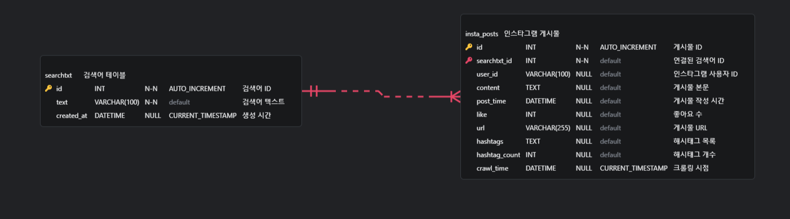

# 🚀 SNS (Instagram) Crawler

검색어(해시태그)를 기준으로 인스타그램 게시물을 자동 수집하여 MySQL DB에 저장하는 프로젝트입니다.
Selenium을 사용해 인스타그램 웹 페이지를 크롤링하며, 크롤링된 데이터는 SQLAlchemy 모델을 통해 MySQL에 저장됩니다.  

**시간당 300개**의 게시물을 수집 및 저장함.

---

## 📦 프로젝트 구성
```text
📁 insta_crawler/
├── app/
│   ├── crawler.py      # Instagram 크롤러 클래스
│   ├── create_db.py    # db 초기 생성
│   ├── db.py           # DB 연결 및 세션 설정
│   ├── logger.py       # 수집 로그 출력 설정
│   ├── main.py         # args 파싱 및 크롤러 시작
│   └── models.py       # SQLAlchemy ORM 모델 정의
│
├── .env                       # 환경 변수 설정 파일 (DB 정보, 시크릿 키 등)
├── insta_cookies.pkl          # instal 로그인 후 생성된 cookies
├── insta_crawler.erd.json     # DB ERD 파일
├── requirements.txt           # Python 패키지 의존성 목록
└── README.md                  # 프로젝트 설명 문서
```

---

## 주요 기능

- ✅ 쿠키 기반 로그인으로 인스타그램 접근
- ✅ 해시태그 기반 검색 및 게시물 수집
- ✅ 게시물 정보 (본문, 사용자, 시간, 해시태그 등) 저장
- ✅ 중복 게시물 저장 방지 (URL 기준)
- ✅ MySQL 기반 데이터 저장
- ✅ ERD 설계 완료

---
## 데이터베이스 구조
insta_crawler.erd.json 파일을 통해 확인할수 있습니다.  


### searchtxt (검색어 테이블)
| 컬럼명 | 타입 | 설명 |
|--------|------|------|
| id | INT, PK, AI | 검색어 ID |
| text | VARCHAR(100), UNIQUE | 검색어 텍스트 |
| created_at | DATETIME | 생성 시간 |

### insta_posts (게시물 테이블)
| 컬럼명 | 타입 | 설명 |
|--------|------|------|
| id | INT, PK, AI | 게시물 ID |
| searchtxt_id | INT, FK | 연결된 검색어 ID |
| user_id | VARCHAR(100) | 인스타그램 사용자 ID |
| content | TEXT | 게시물 본문 |
| post_time | DATETIME | 게시 시간 |
| like | INT | 좋아요 수 |
| url | VARCHAR(255), UNIQUE | 게시물 URL |
| hashtags | TEXT | 해시태그 목록 (쉼표 구분) |
| hashtag_count | INT | 해시태그 개수 |
| crawl_time | DATETIME | 수집 시각 |

## 실행 방법

1. 가상환경 활성화 및 패키지 설치
    ```bash
    python -m venv venv
    source venv/bin/activate
    pip install -r requirements.txt
    ```

2. `.env` 파일 설정 (예: DB 접속 정보)
    ```text
    DB_USER=DB_USER
    DB_PASSWORD=DB_PASSWORD
    DB_HOST=localhost
    DB_PORT=3306
    DB_NAME=crawler
    ```

3. 쿠키 저장 (`insta_cookies.pkl` 파일 필요)
    - selenium 실행 후 수동으로 로그인 후 쿠기 저장 필요


4. 크롤러 실행
    ```bash
    python app/main.py --tags 광진구 맛집
    ```

---

## 한계점과 해결 과정 (Challenges & Solutions)
❗ 문제: 좋아요 수가 0인 게시물은 HTML에 해당 요소가 존재하지 않아, 대기만 하다 통과됨
- 현상: 좋아요 수가 0인 게시물에서는 좋아요 관련 DOM 요소 자체가 렌더링되지 않음

- 결과: WebDriverWait은 presence_of_element_located 조건이 충족되지 않아 10초간 기다린 뒤 아무 일 없이 통과

- 문제점: 없는경우 0으로 처리를 해두어 오류는 없으나 10초씩 기다리기 때문에 수집 속도가 저하됨.

✅ 해결 방법:
- time.time()을 활용해 최대 1초 동안 반복적으로 요소를 검사
- 숫자 형태(^\d+)가 발견되면 즉시 좋아요 수로 파싱하고 루프 종료
- 끝까지 숫자를 찾지 못하면 좋아요 수는 0으로 간주

    ```python
    # 좋아요 수 수집
    like_cnt = 0
    try:
        start_time = time.time()
        while time.time() - start_time < 1:
            spans = self.driver.find_elements(By.CSS_SELECTOR, "section span")
            for span in spans:
                text = span.text.strip()
                if re.match(r'^[\d,.]+$', text):
                    like_cnt = int(text.replace(",", "").replace(".", ""))
                    break
            if like_cnt > 0:
                break
            sleep(0.1)
    except Exception as e:
        self.logger.warning(f"[likes 예외] {e}")
    ```

❗ 문제: 중복된 게시물을 저장하는 경우
- 현상: insta_posts 테이블에 url을 unique옵션을 주었고, 데이터는 100개씩 object를 list에 임시 저장 후 db insert 중 오류 현상
- 결과: 오류 무한 루프에 빠짐

✅ 해결 방법:
- db_buffer에 데이터를 추가하기 전에 db에 url이 있는지 존재 여부를 확인 후 저장
- 기존 1개의 post 크롤링시 대부분 1초가 걸리지 않았으나, 중복 확인후 추가 하는 작업을 수행하니 1개 게시물당 1초 이상씩 시간이 소요됨

```python
# DB 중복 확인
with SessionLocal() as db:
    in_db = self.search_url(db, current_url)
if not in_db:
    self.db_buffer.append(post)
else:
    self.logger.info(f'중복 게시물 => user_id: {user_id}, url: {current_url}')
```

❗ 문제: 중복된 게시물을 저장 안함 처리
- 현상: 중복된 게시물 저장을 방지하기 위해 MySQL에서 URL을 조건 조회함
- 결과: URL 조회가 추가되면서 전체 수집 속도가 느려지는 현상 발생

✅ 해결 방법:
-  MySQL 대신 Redis를 활용하여 중복 여부를 빠르게 조회
- 10건 기준으로 중복 수집이 되면 check_point False로 수집 중단
- 10건 로그 분석을 통해 약 30배 이상 속도 개선
- 운영 정책: 
    - 현재는 7일 TTL로 설정하여 일정 기간 동안만 중복 여부 유지.
    - 저장 목적이 아카이빙이 아닌 중복 방지라면, 1일 TTL로 단기 캐싱 전략도 가능.  

중복 확인 시간 비교 (Redis vs MySQL)
| 항목       | Redis         | MySQL         |
|------------|---------------|---------------|
| 최대 시간  | 0.00258 sec   | 0.09923 sec   |
| 최소 시간  | 0.00061 sec   | 0.01515 sec   |
| 평균 시간  | ✅ **0.00091 sec** | ❗ **0.03058 sec** |


